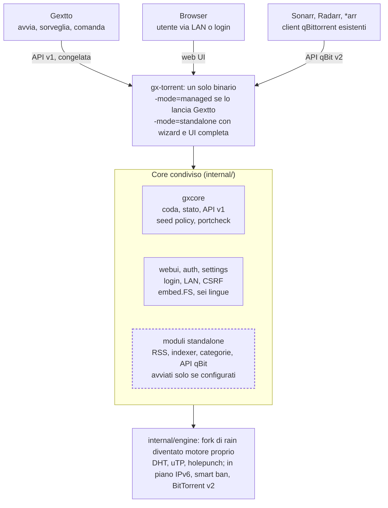

# gx-torrent evoluto: da motore di Gextto a client torrent standalone

Analisi completa della domanda: **è meglio evolvere `gx-torrent` in un client
standalone oppure creare un nuovo progetto `gx-nox`?** Data: **2026-10-10**.

Questo documento è la **decisione e il piano**. Lo stato corrente del motore è in
[`docs/gx-torrent.md`](gx-torrent.md); il backlog del motore e le misure in
[`docs/evoluzione.md`](evoluzione.md) (§4–§7); la procedura di rebase del fork in
[`docs/rain-allineamento.md`](rain-allineamento.md); l'inventario delle modifiche
a rain in [`third_party/rain/GEXTTO.md`](../third_party/rain/GEXTTO.md).

> [!NOTE]
> Nato dall'estrazione della §14 di `evoluzione.md`, che ora rimanda qui. Il
> documento tecnico `gx-torrent.md` descrive **ciò che c'è**; questo descrive
> **dove si vuole andare**, e resta separato per non mescolare i due piani.

## Indice

1. [Sintesi](#1-sintesi)
2. [Domanda, requisiti e criteri](#2-domanda-requisiti-e-criteri)
3. [Stato attuale](#3-stato-attuale)
4. [Gap analysis](#4-gap-analysis)
5. [Le tre strade](#5-le-tre-strade)
6. [Decisione (ADR)](#6-decisione-adr)
7. [Architettura target](#7-architettura-target)
8. [Costo zero quando lo standalone non è usato](#8-costo-zero-quando-lo-standalone-non-è-usato)
9. [Modello di sicurezza](#9-modello-di-sicurezza)
10. [Requisito "migliore di qBittorrent"](#10-requisito-migliore-di-qbittorrent)
11. [Cherry-pick dal motore e licenze](#11-cherry-pick-dal-motore-e-licenze)
12. [Roadmap e cancelli](#12-roadmap-e-cancelli)
13. [Requisiti → soluzione](#13-requisiti--soluzione)
14. [Rischi e mitigazioni](#14-rischi-e-mitigazioni)
15. [Domande aperte](#15-domande-aperte)
16. [Riferimenti](#16-riferimenti)

---

## 1. Sintesi

**Risposta: conviene evolvere `gx-torrent`, non creare un nuovo `gx-nox`.** Un
solo binario con due modalità: `-mode=managed` quando lo lancia Gextto (comanda
Gextto) e `-mode=standalone` quando è un prodotto a sé (comanda gx-torrent).
"gx-nox" può restare il **nome pubblico** della modalità standalone, ma non è un
secondo progetto.

Il motivo decisivo non è la fatica iniziale, è il **requisito 5** (a tendere:
staccarsi da rain e fare cherry-pick da libtorrent/anacrolix). Quel percorso
trasforma il motore in codice vostro: con due progetti ci sarebbero **due
divergenze dello stesso motore**, e ogni porting andrebbe fatto due volte.
Prima o poi `gx-torrent` resterebbe indietro e Gextto si ritroverebbe col motore
peggiore dei due.

Il **requisito 1** (compatibilità perfetta con Gextto) è la ragione per cui la
strada nuova è rischiosa: si garantisce con **un solo motore + test di contratto
sull'API v1**, non con due fork da risincronizzare a mano.

Il punto di partenza è più avanti di quanto sembri: gx-torrent ha già REST API,
pagina web in sei lingue, coda, limiti per torrent, streaming, super-seeding,
holepunching, UPnP/NAT-PMP e test della porta. Per diventare un'alternativa a
qbittorrent-nox gli mancano soprattutto **le cose che oggi fa Gextto al posto
suo** (autenticazione, impostazioni da UI, categorie/tag, RSS, ricerca su
indexer, wizard) più due lacune di motore che uno standalone non può permettersi:
**IPv6** e **BitTorrent v2**.

Tre condizioni perché la scelta regga (dettaglio in §6–§8):

- **Una sola regola di potere**: in managed comanda Gextto (coda, categorie, RSS
  restano suoi); in standalone comanda gx-torrent. Le funzioni standalone si
  **spengono**, non si duplicano, quando Gextto è presente.
- **Prima il refactor, poi le funzioni**: `cmd/gx-torrent` è oggi un unico
  `package main` da ~10.800 righe (14.100 col test); va spezzato in pacchetti
  riusabili prima di aggiungerne altre.
- **Il contratto con Gextto diventa un test**: le risposte dell'API v1 usate da
  `gxtorrent_engine.go` vanno fissate in test di contratto che girano a ogni
  build. È il cancello che rende innocuo tutto il resto.

---

## 2. Domanda, requisiti e criteri

### 2.1 La domanda

> Evolvere `gx-torrent` in **anche** un client torrent standalone: mantenendo la
> perfetta compatibilità con Gextto, se lanciato da solo diventa l'equivalente di
> `qbittorrent-nox`.

### 2.2 I requisiti

I requisiti hanno **pesi diversi**: il primo è un **vincolo**, gli altri sono
**obiettivi**. Ogni scelta che migliora lo standalone ma tocca il percorso Gextto
va respinta o messa dietro un flag.

| # | Requisito | Tipo | Implicazione progettuale |
| --- | --- | --- | --- |
| 1 | Funziona perfettamente con Gextto | **vincolo** | API v1 congelata; in managed nessuna funzione standalone attiva; `fingerprint` stabile |
| 2 | Client efficace, potente, parsimonioso, migliore di qbittorrent-nox | obiettivo | misure contro qbittorrent-nox; niente funzioni che consumano se non usate |
| 3 | Interfaccia web ottima, facile e completa come qBittorrent | obiettivo | UI come applicazione (asset, impostazioni, categorie/tag, RSS, ricerca), non una pagina operativa |
| 4 | Wizard di primo avvio | obiettivo | lingua, cartelle, password, LAN senza password (default sì), porte + test porta, indexer Jackett/Prowlarr/MIRCrew |
| 5 | A tendere staccarsi da rain; cherry-pick da rain/anacrolix/libtorrent | direzione | motore trattato come codice proprio; un solo motore condiviso dai due usi |

### 2.3 Criteri di valutazione

Per scegliere tra le strade (§5) uso sette criteri, valutati a parità di
requisiti:

1. **Compatibilità con Gextto** (requisito 1): quanto è garantita per costruzione.
2. **Manutenzione del motore**: quanti fork/alberi di codice vanno tenuti.
3. **Propagazione di fix e migliorie**: una modifica arriva a entrambi gli usi o
   va portata a mano?
4. **Peso del binario gestito**: cosa Gextto si porta dietro anche se non lo usa.
5. **Superficie d'attacco in managed**: quanto codice in più è raggiungibile.
6. **Libertà di design** di API e UI standalone.
7. **Tempo al primo standalone usabile**.

---

## 3. Stato attuale

gx-torrent è un demone Go puro (build `CGO_ENABLED=0`) su un fork di rain v2.4.2,
con **24 aree** modificate marcate `gextto fork` (128 occorrenze nel codice; vedi
`GEXTTO.md`). Gextto lo avvia, lo sorveglia e lo **riaggancia ai riavvii** tramite
`fingerprint`. Il demone è già usabile da solo (`gx-torrent -listen … -data …`),
ma è pensato come motore subordinato.

| Strato | Dove | Cosa c'è già | Dimensione (2026-10-10) |
| --- | --- | --- | --- |
| Motore | `third_party/rain`, `third_party/dht`, `anacrolix/utp` | porta unica, uTP, DHT, PEX, LSD, MSE, holepunch BEP 55, super-seeding BEP 16, web seed e tracker a caldo, limiti per torrent, streaming con finestra, filtro IP multi-formato, proxy, killswitch VPN, preallocazione, cache regolabile a caldo | 24 aree modificate |
| Demone | `cmd/gx-torrent` | coda dinamica con slot, seed ratio/giorni per torrent, tracker health, UPnP/NAT-PMP, `portcheck`, stato in `state.json` | 10.786 righe (14.144 col test) |
| API | `cmd/gx-torrent/api.go` | REST v1 con header `X-Gx-Token`: health, stats, portcheck, torrents, add, azioni, config, ipfilter | 588 righe |
| UI | `cmd/gx-torrent/ui.go` | tabella, filtri per stato, dettaglio a schede (generale, file, peer, tracker, pezzi), azioni di gruppo, sei lingue | 1.836 righe, `html/template` + JS inline |
| Adapter | `gxtorrent_engine.go`, `gxtorrent_runtime.go` | contratto `TorrentEngine`, matrice `capabilityLevels`, avvio in scope systemd | 1.801 + 728 righe |

Misure grezze, come base per il requisito 2: `bin/gx-torrent` pesa **13,7 MB**; il
demone in esercizio su questa macchina usa **~307 MB di RSS** e 10 thread, quasi
tutti di cache dei pezzi.

Cose oggi legate **solo** a Gextto: `-orphan-timeout`, `-fingerprint`,
`-gextto-log`, `-ipfilter-source`. Tutte le altre opzioni sono flag o variabili
d'ambiente **lette solo all'avvio**: non esiste un file di impostazioni
modificabile dalla UI.

---

## 4. Gap analysis

### 4.1 Funzioni che oggi fornisce Gextto, non il demone

| Funzione | Oggi in Gextto | In gx-torrent | Dove andrà |
| --- | --- | --- | --- |
| Login, sessioni, password | UI v2 (`authEnabledSetting`, argon2/bcrypt) | solo token condiviso | `internal/webui` + `internal/auth` |
| Impostazioni persistenti da UI | `uiweb_v2_settings*` | flag d'avvio | `settings.json` + `internal/settings` |
| Wizard primo avvio | `uiweb_v2_setup.go` (527 righe, 5 passi: Accesso, Cartelle, Fonti, Primo titolo, Attiva) | assente | `internal/webui/setup` |
| Categorie, tag, percorso per categoria | sì | assente | `internal/gxcore` |
| RSS con regole di scarico | `rss.go` (2.588 righe) | assente | `internal/rss` (estratto) |
| Ricerca Torznab/Prowlarr/Jackett/MIRCrew | `websearch.go` (863), `torznab_caps.go` (243), `indexer_health.go` (121) | assente | `internal/indexer` (estratto) |
| Scheduler di banda, limiti alternativi | sì | solo limiti fissi | `internal/gxcore` |
| Notifiche, hook a fine download | `notifier.go`, `hooks.go` | assente | `internal/gxcore` (opzionale) |
| Spostamento a fine download, cartella temporanea | `postprocess.go` | solo sposta manuale | `internal/gxcore` |

**Vincolo di codice, non di volontà**: ricerca e RSS stanno nel **pacchetto
radice** `gextto` (240 file `.go`) e non sono importabili dal demone senza
trascinarsi dietro tutto Gextto. Vanno **estratti in `internal/`** prima di poterli
condividere. È il costo nascosto più grosso della strada A.

### 4.2 Lacune del motore

- **IPv6**: il listener a porta unica, il DHT e uTP usano socket IPv4. Decisione
  storica §4.3 ("No"); per la parità con qBittorrent non è più rinviabile, perché
  molti peer domestici sono raggiungibili solo in v6.
- **BitTorrent v2**: rain legge v1 e la parte v1 degli ibridi; i v2-only sono
  rifiutati (`errV2Only`). Servono alberi di hash SHA-256, handshake con hash
  troncato e piece layer.
- **Qualità**: smart ban dei peer corrotti, profondità adattiva della coda
  richieste, choking rate-based, reader con readahead per lo streaming, I/O disco
  a blocchi contigui. Sono "cherry-pick" (§11), non blocchi.

### 4.3 Debito tecnico che ostacola tutto

- `cmd/gx-torrent` è un **monolite `package main`**; senza refactor ogni funzione
  nuova va infilata lì dentro.
- `ui.go` tiene HTML in stringhe Go: con categorie/tag, RSS, ricerca, grafici e
  gestione di migliaia di torrent non regge. Serve una cartella asset con
  `embed.FS`.
- La logica di coda è già pura (`queue.go`) e ben testata: è il primo pezzo da
  promuovere a pacchetto.

---

## 5. Le tre strade

- **A. Evolvere gx-torrent**: stesso binario, `-mode=managed|standalone`, funzioni
  standalone spente in managed.
- **B. Nuovo gx-nox separato**: nuovo repository o nuovo `cmd/`, copia del motore,
  evoluzione indipendente.
- **C. Core condiviso, due binari**: `internal/engine` + `internal/gxcore` usati
  da `cmd/gx-torrent` (snello, per Gextto) e `cmd/gx-nox` (completo).

| Criterio | A. Evolvere | B. Nuovo gx-nox | C. Core + due binari |
| --- | --- | --- | --- |
| Compatibilità Gextto (req. 1) | garantita dai test esistenti | da risincronizzare a mano | garantita: Gextto usa il binario snello |
| Manutenzione del motore | un fork di rain | due fork che divergono | un fork |
| Propagazione di fix e migliorie | arrivano a entrambi | portate a mano | arrivano a entrambi |
| Peso del binario per Gextto | cresce con UI, RSS, ricerca | invariato | invariato |
| Superficie d'attacco in managed | più codice, ma spento | invariata | invariata |
| Libertà di design dell'API e UI | vincolata da v1 | totale | totale sopra v1 |
| Tempo al primo standalone usabile | il più breve | il più lungo | breve, dopo il refactor |

**Il rischio vero di B è il requisito 5.** Se `gx-nox` e `gx-torrent` sono
progetti distinti, ogni porting dal motore va fatto due volte, oppure `gx-torrent`
resta indietro e Gextto si ritrova col motore peggiore dei due. Dopo un anno il
secondo caso è quasi certo.

**Tra A e C**: C terrebbe fuori dal demone gestito il codice di RSS e ricerca. Lo
stesso risultato si ottiene in A **se quel codice non parte finché non serve**
(§8): un solo artefatto da compilare e distribuire, e nessun rischio che i due
binari divergano. Il refactor della fase 0 crea comunque i pacchetti del core,
quindi separare un secondo binario resta possibile il giorno in cui le misure lo
giustificassero.

---

## 6. Decisione (ADR)

**Stato**: accettata (2026-10-10).

**Contesto**: si vuole anche un client standalone, senza rompere l'uso come motore
di Gextto, e con la prospettiva di staccarsi da rain.

**Decisione**: **strada A**. Un solo binario `gx-torrent`, due modalità decise
all'avvio:

- `-mode=managed` (passato da `gxtorrent_runtime.go`): comportamento di oggi.
- `-mode=standalone`: wizard, login, impostazioni persistenti, UI completa.
- Senza flag: **managed se c'è `-fingerprint`**, altrimenti standalone.

"gx-nox" resta il **nome pubblico** con cui lo standalone si presenta agli
utenti/documentazione; non è un secondo binario né un secondo repository.

**Conseguenze positive**: un fork di rain; fix e ottimizzazioni arrivano a
entrambi; compatibilità Gextto garantita per costruzione; tempo al primo
standalone usabile minimo.

**Conseguenze negative / costi accettati**: il binario gestito contiene anche il
codice standalone (mitigato dalle regole del §8); l'API e la UI standalone
convivono con la v1 congelata (mitigato dall'additività).

**Alternative scartate**: B perché raddoppia la manutenzione del motore proprio
mentre lo si vuole staccare da rain; C perché il beneficio (demone snello) si
ottiene già con l'avvio pigro dei moduli, senza introdurre due binari.

**Cosa farebbe riaprire la decisione**: se Gextto abbandonasse gx-torrent per
qBittorrent o libtorrent, il vincolo di compatibilità sparisce e B torna sensato.

---

## 7. Architettura target

Il motore e la logica di coda diventano pacchetti interni; sopra sta un solo
`main` che sceglie la modalità all'avvio. Il riquadro tratteggiato è il codice che
in managed non viene mai avviato.

Gextto lancia il binario con `-mode=managed` e parla l'API v1; browser e client
*arr parlano con lo stesso binario lanciato in `-mode=standalone`. Ogni miglioria
del motore arriva a entrambi gli usi senza alcun porting.

### 7.1 Scelte di dettaglio

- **API v1 congelata**: si aggiunge, non si cambia; le funzioni standalone vivono
  sotto `/api/v2` o `/ui`. Test di contratto sull'API v1 usata da
  `gxtorrent_engine.go`.
- **Modalità**: decisa all'avvio, **mai cambiata a caldo**.
- **Impostazioni**: un file `settings.json` nella cartella dati, scritto dalla UI
  con scrittura atomica. In managed i flag passati da Gextto **vincono sempre** sul
  file, così il `fingerprint` resta stabile e Gextto non riavvia il demone a ogni
  salvataggio.
- **UI**: HTML, CSS e JS in `internal/webui/assets` con `embed.FS`, aggiornamenti
  via SSE o polling come oggi (`/ui/live`). Niente framework con build Node: il
  binario resta compilabile con il solo `go build`, coerente con l'UI di Gextto
  (SSR + HTMX).
- **API compatibile qBittorrent** (`/api/v2/auth`, `/api/v2/torrents/*`,
  `/api/v2/app/*`): è la funzione che porta utenti, perché Sonarr, Radarr,
  Prowlarr e le app mobili la parlano già. Gextto ha un client qBittorrent
  completo in `qbittorrent_engine.go`: si può usare come **banco di prova
  automatico** di questa API.
- **Indexer e RSS**: estratti dal pacchetto radice in `internal/indexer` e
  `internal/rss`, condivisi dai due prodotti.
- **Distribuzione**: binario statico per amd64 e arm64, unit systemd, immagine
  container. Il pacchetto di Gextto continua a includere solo `gx-torrent`.

---

## 8. Costo zero quando lo standalone non è usato

**In un binario Go il codice non usato pesa solo su disco; pesa in CPU e RAM solo
ciò che viene avviato.** Linux carica le pagine dell'eseguibile solo quando
vengono eseguite: RSS, indexer e wizard compilati ma mai chiamati non entrano in
memoria. Il rischio vero sono le cose che **partono da sole all'avvio**.

### 8.1 Regole per ogni modulo standalone

1. **Niente lavoro in `init()` né in variabili di pacchetto.** Template, cataloghi,
   regex e client HTTP si costruiscono al primo uso con `sync.Once`. Oggi
   `uiTemplate` in `ui.go` viene già compilato all'avvio: va reso pigro anche lui.
2. **Nessuna goroutine o ticker se il modulo è spento.** Il poller RSS, il
   controllo degli indexer e lo scheduler partono solo se in `settings.json` c'è
   almeno un feed, un indexer o una regola. In managed non partono mai.
3. **Nessun database o file aperto in anticipo.** Lo storico RSS e la cache delle
   ricerche si aprono al primo feed configurato.
4. **Le rotte HTTP si registrano sempre**, ma rispondono 404 o rimandano al wizard
   se il modulo è spento: registrare una rotta costa pochi byte.
5. **Asset della UI con `embed.FS`**: restano nel binario su disco e si leggono
   solo quando un browser li chiede.

### 8.2 Test di guardia

Nel cancello della fase 0 e di ogni fase dopo: un test avvia il demone in modalità
**managed** e confronta con la base quattro grandezze — RSS a riposo (tolleranza
5%), numero di goroutine e thread, tempo di avvio, CPU in 60 secondi di
inattività. Se una delle quattro peggiora, la build fallisce.

---

## 9. Modello di sicurezza

Oggi il demone ha un solo meccanismo: un **token condiviso** (`X-Gx-Token`). Per
lo standalone servono autenticazione vera e sessioni.

### 9.1 Accesso

- Utente e password con hash **argon2id** (o bcrypt), sessioni con cookie `Secure`
  e `HttpOnly`, scadenza e revoca.
- Il login vale per la UI standalone; l'API v1 in managed resta col token, che
  **non** si mescola col login.

### 9.2 LAN senza password: default sì, ma con tre protezioni

Richiesto dal requisito 4 (default sì). Senza protezioni, qualunque sito aperto
da un PC della LAN può aggiungere o cancellare torrent. Quindi:

- **CSRF**: rifiutare le POST senza `Origin`/`Referer` uguale all'host della UI,
  oppure con token di form.
- **DNS rebinding**: accettare solo richieste con `Host` uguale a un IP locale o a
  nomi configurati.
- **Definizione di LAN**: indirizzo sorgente RFC 1918, link-local, loopback e ULA
  IPv6, letti **dal socket**. `X-Forwarded-For` si accetta **solo da proxy
  dichiarati**, altrimenti un reverse proxy rende "LAN" tutto Internet.

In managed queste protezioni e il wizard non si attivano (nessun login richiesto
dal demone: comanda Gextto).

---

## 10. Requisito "migliore di qBittorrent"

"Migliore di qbittorrent-nox" va **dimostrato con misure**, non dichiarato.
Metriche proposte, sempre confrontate con qbittorrent-nox (libtorrent 2.0) sulla
stessa macchina:

| Metrica | Scenario | Obiettivo |
| --- | --- | --- |
| RSS a riposo | 0 torrent attivi, 500 in seed | ≤ qbittorrent-nox |
| CPU per Gbit/s | download su LAN da seed locale | ≤ 1,2× qbittorrent-nox |
| Tempo di avvio | 2.000 torrent con fast resume | ≤ qbittorrent-nox |
| Velocità su sciame reale | 10 torrent pubblici, mediana su 5 run | ≥ 0,95× qbittorrent-nox |

**Dove si può vincere**: memoria a riposo, semplicità di installazione (un binario
statico, niente Qt né Boost), avvio a freddo, distribuzione (container, arm64).
**Dove è difficile**: il throughput puro e il choking fine, dove libtorrent ha
anni di vantaggio e il Go paga GC e goroutine per peer. L'onestà qui è parte del
requisito: si pubblicano le misure a ogni release, vincenti o no.

---

## 11. Cherry-pick dal motore e licenze

Il fork di rain è già una base solida e sorvegliata. Le due lacune che pesano di
più per uno standalone sono IPv6 e BitTorrent v2; tutto il resto è qualità che si
porta **un algoritmo alla volta**, misurando prima e dopo. Valutazioni di memoria,
da verificare sul codice delle librerie prima di ogni porting.

| Area | gx-torrent (rain fork) | anacrolix/torrent | libtorrent 2.0 | qbittorrent-nox |
| --- | --- | --- | --- | --- |
| Linguaggio, licenza | Go, MIT | Go, MPL-2.0 | C++, BSD-3 | C++/Qt, GPL-2+ |
| IPv6 | no (decisione §4.3: "No") | sì | sì | sì |
| BitTorrent v2 / ibridi | v1 e ibridi letti come v1 | sì | sì | sì |
| uTP | sì (`anacrolix/utp`) | sì | sì, LEDBAT proprio | sì |
| Holepunch BEP 55 | sì (fork) | sì | sì | sì |
| Streaming | finestra + HTTP Range, attesa a polling | Reader con seek e readahead | deadline per pezzo | sì |
| Storage | file | file, mmap, bolt, sqlite, pluggable | file, mmap (2.0) | libtorrent |
| WebTorrent | no | sì | no | no |
| Choking seed | default di rain, misurato corretto | semplice | più algoritmi (rate-based, anti-leech) | libtorrent |
| Smart ban (pezzi corrotti) | no | sì | sì | sì |
| API compatibile qBittorrent | no | no | — | è il riferimento |

### 11.1 Cosa prendere, in ordine di valore

| # | Funzione | Fonte | Perché | Costo |
| --- | --- | --- | --- | --- |
| 1 | IPv6 (listener, DHT BEP 32, tracker, PEX) | anacrolix, libtorrent | senza IPv6 non c'è parità con qBittorrent; molti peer domestici sono raggiungibili solo in v6 | alto |
| 2 | Smart ban | libtorrent, anacrolix | banna il peer che invia blocchi di un pezzo fallito; protegge da sciami avvelenati | basso |
| 3 | Profondità della coda richieste adattiva | libtorrent | la velocità su peer lontani dipende da quante richieste sono in volo | medio |
| 4 | Reader con readahead per lo streaming | anacrolix | sostituisce l'attesa a polling (200 ms, timeout 2 min) | medio |
| 5 | BitTorrent v2 e ibridi | anacrolix (Go, più vicino a rain) | torrent v2-only già in circolazione; serve merkle per file | alto |
| 6 | Choking rate-based e anti-leech | libtorrent | qualità del seeding; da validare con l'harness `unchoker/sim_test.go` | medio |
| 7 | Disk I/O: scrittura in blocchi contigui, hash su pool | libtorrent | CPU e usura disco su NAS lenti | medio |
| 8 | Share mode | libtorrent | già scartato per Gextto (§4.3, decisione 2); per lo standalone vale come opzione | basso |
| 9 | WebTorrent | anacrolix | nicchia | alto |

### 11.2 Licenze

Gextto è **EUPL-1.2**. Da **libtorrent** (BSD-3) si può portare codice con
l'attribuzione. Da **anacrolix** (MPL-2.0) il codice copiato resta MPL file per
file: meglio **riscrivere l'algoritmo** che copiare i file. Da **qBittorrent**
(GPL) non si copia nulla; reimplementare il suo protocollo Web API è lecito.
rain è MIT, `nictuku/dht` è BSD, `anacrolix/utp` è MPL-2.0 (dipendenza non
modificata).

### 11.3 Staccarsi da rain

Il requisito 5 significa rinunciare al **rebase periodico** descritto in
`docs/rain-allineamento.md` e trattare rain come codice proprio: modulo
rinominato, cartella spostata da `third_party/` a `internal/engine`, inventario
`GEXTTO.md` trasformato in changelog del motore. Va deciso **quando**: è un
traguardo di F4, non della fase 0 (spostare il pacchetto prima del refactor
aggiunge solo rischio).

---

## 12. Roadmap e cancelli

La fase 0 non aggiunge funzioni ma è quella che rende possibile tutto il resto
senza toccare Gextto. Le fasi del motore (F4) possono partire da F1 in parallelo,
perché vivono sotto lo stesso core e migliorano anche Gextto. Nessuna stima di
durata: la complessità è indicata come S/M/L e dipende dal tempo che ci si dedica.

| Fase | Contenuto | Cancello (si chiude quando) | Complessità |
| --- | --- | --- | --- |
| **F0 · Refactor e contratto** | core in `internal/`, test di contratto API v1, template `ui.go` pigro e asset `embed.FS` | Gextto invariato, `make test` verde, test di guardia §8.2 verde | M |
| **F1 · Standalone minimo** | `settings.json`, login e LAN sicura, wizard, test porta, unit systemd | installazione pulita senza Gextto, primo download dal wizard | M |
| **F2 · Parità con la WebUI di qBittorrent** | categorie e tag, cartella temporanea, RSS, ricerca indexer, scheduler, virtualizzazione tabella | checklist funzioni qBittorrent completa | L |
| **F3 · Ecosistema** | API compatibile qBit v2, pacchetto standalone, immagine container | Sonarr aggiunge e importa un episodio senza patch | M |
| **F4 · Motore proprio** (in parallelo da F1) | IPv6, smart ban, coda richieste adattiva, readahead, BitTorrent v2, eventuale spostamento `internal/engine` | misure contro qbittorrent-nox §10 | L |

Ogni fase si chiude **solo** quando il suo cancello è verificato. Il cancello di F0
vale anche per tutte le fasi successive: **ogni commit deve lasciare Gextto
invariato**.

### 12.1 Stato di attuazione

Aggiornato al 2026-10-10.

| Voce F0 | Stato |
| --- | --- |
| Logica di coda estratta in `internal/queue` (con i suoi test) | fatto |
| Test di contratto API v1 (`cmd/gx-torrent/contract_test.go`) | fatto |
| `ui.go`: template pigro (`sync.Once`) e asset in `internal/webui/assets` (`embed.FS`) | fatto |
| Test di guardia §8.2 (goroutine, tempo di avvio, assenza di lavoro idle) | fatto |
| Test di guardia §8.2: RSS e CPU contro qbittorrent-nox | da fare (harness opt-in) |
| F1: `-mode` managed/standalone (autodetect da `-fingerprint`) e store `settings.json` (base) | fatto |
| F1: protezione CSRF/same-origin della pagina in standalone | fatto |
| F1: DNS rebinding (`Host` IP/localhost) e classificazione sorgente LAN | fatto |
| F1: login con password (bcrypt), sessioni, bypass LAN senza password | fatto |
| F1: ascolto LAN senza token permesso in standalone (managed invariato) | fatto |
| F1: wizard di primo avvio (lingua, cartella, password, LAN, porta) | fatto |
| F1: wizard — indexer opzionali (Jackett/Prowlarr/MIRCrew) e cartella temporanea | da fare |
| F3: API compatibile qBittorrent (auth, app, transfer, torrents info/add/delete/pause/resume/recheck/properties/files/trackers/reannounce/setLocation + categorie/tag) | fatto |
| F3: compatibilità verificata col client qBittorrent di Gextto (`internal/qbittorrent`) | fatto |
| F2: categorie/tag nella pagina (filtro laterale + editor nel dettaglio) | fatto |
| F3: app/preferences e altri endpoint qBittorrent | fatto |
| Spostamento del motore in `internal/engine` | F4 (§11.3) |

---

## 13. Requisiti → soluzione

| Requisito | Come viene soddisfatto | Fase | Verifica |
| --- | --- | --- | --- |
| 1. Compatibilità Gextto | un solo motore; API v1 congelata; modalità managed con funzioni standalone spente; `fingerprint` stabile | F0 | test di contratto API v1; `make test`; zero riavvii del demone per salvataggi UI |
| 2. Efficienza | avvio pigro dei moduli; cache adattiva; misure contro qbittorrent-nox | F1, F4 | le 4 metriche del §10 |
| 3. UI alla pari di qBittorrent | asset `embed.FS`, impostazioni da UI, categorie/tag, RSS, ricerca, grafici, telefono, tema scuro | F2, F3 | checklist qBittorrent + test Playwright (come `uiweb/v2/end2end`) |
| 4. Wizard | lingua, cartelle, accesso (LAN senza password default sì + 3 protezioni), porte + test porta, indexer Jackett/Prowlarr/MIRCrew | F1 | setup da zero in meno di 5 minuti |
| 5. Staccarsi da rain | motore trattato come codice proprio; cherry-pick per valore; licenze rispettate | F4 | misura prima/dopo ogni porting; changelog del motore |

---

## 14. Rischi e mitigazioni

| Rischio | Effetto | Contromisura |
| --- | --- | --- |
| Regressione nel percorso Gextto | download bloccati sull'installazione principale | test di contratto API v1; `fingerprint` indipendente da `settings.json`; funzioni standalone spente in managed |
| Due padroni della stessa coda | torrent spostati due volte, limiti sovrascritti | modalità decisa all'avvio, mai cambiata a caldo |
| LAN senza password sfruttata | un sito esterno aggiunge o cancella torrent dal browser dell'utente | controllo `Origin` e `Host`, LAN letta dal socket, `X-Forwarded-For` solo da proxy dichiarati |
| UI che cresce in una stringa Go | modifiche lente, regressioni visive | asset in `embed.FS` e test Playwright come quelli di `uiweb/v2/end2end` |
| Porting dal motore costoso | IPv6 e v2 toccano DHT, tracker, picker, storage | un porting per volta, con test del fork e misura prima/dopo |
| Licenze | codice MPL dentro file EUPL | riscrivere gli algoritmi di anacrolix invece di copiarli |
| Fine del rebase su rain | si perdono eventuali fix upstream | upstream è lento; controllare a mano i suoi commit una volta a trimestre |
| Estrazione di RSS/ricerca dal pacchetto radice | refactor ampio, possibile instabilità in Gextto | estrarre in `internal/` a comportamento costante, con i test esistenti come rete |

---

## 15. Domande aperte

Decisioni da prendere **prima** di F1/F2, non urgenti in F0:

1. **Nome pubblico**: "gx-torrent" per il binario e "gx-nox" come nome dello
   standalone, oppure "gx-nox" solo per la release standalone? (Proposta: binario
   `gx-torrent`, presentazione "gx-nox" nella documentazione utente.)
2. **Modulo del motore**: rinominare `github.com/cenkalti/rain/v2` in un modulo
   proprio e spostare in `internal/engine` a inizio o fine di F4?
3. **Dove vivono i moduli condivisi**: estrarre RSS/indexer in `internal/` dentro
   il repo Gextto (condivisi dai due prodotti) o in un modulo separato?
4. **Target di distribuzione**: solo Linux (amd64/arm64) come gextto, o anche
   Windows/macOS come client desktop?
5. **i18n**: le sei lingue della pagina web bastano per il prodotto standalone, o
   si estende il catalogo?
6. **Autenticazione**: argon2id o bcrypt? (Proposta: argon2id, come già fa Gextto.)

---

## 16. Riferimenti

- [`docs/gx-torrent.md`](gx-torrent.md) — riferimento tecnico del motore attuale.
- [`docs/evoluzione.md`](evoluzione.md) — §4–§7: lacune del motore, ottimizzazioni,
  misure di choking; §14: rimando a questo documento.
- [`docs/rain-allineamento.md`](rain-allineamento.md) — rebase del fork di rain.
- [`third_party/rain/GEXTTO.md`](../third_party/rain/GEXTTO.md) — inventario delle
  modifiche al fork.
- [`docs/ARCHITECTURE.md`](ARCHITECTURE.md) — mappa del codice di Gextto.
- [`LICENSE`](../LICENSE) — EUPL-1.2.
